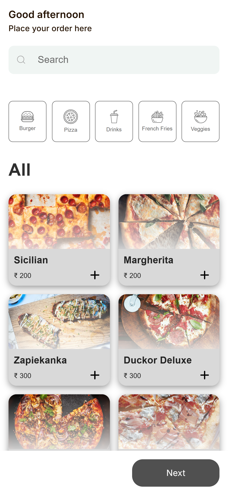
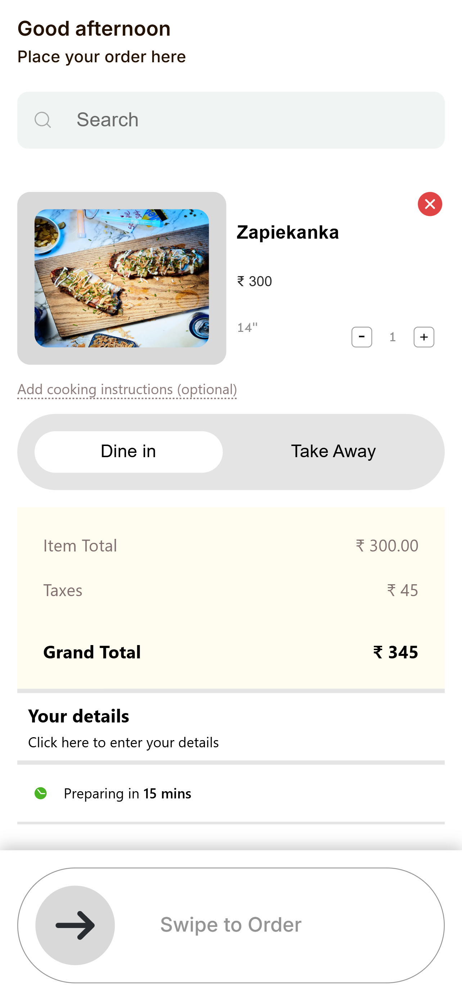
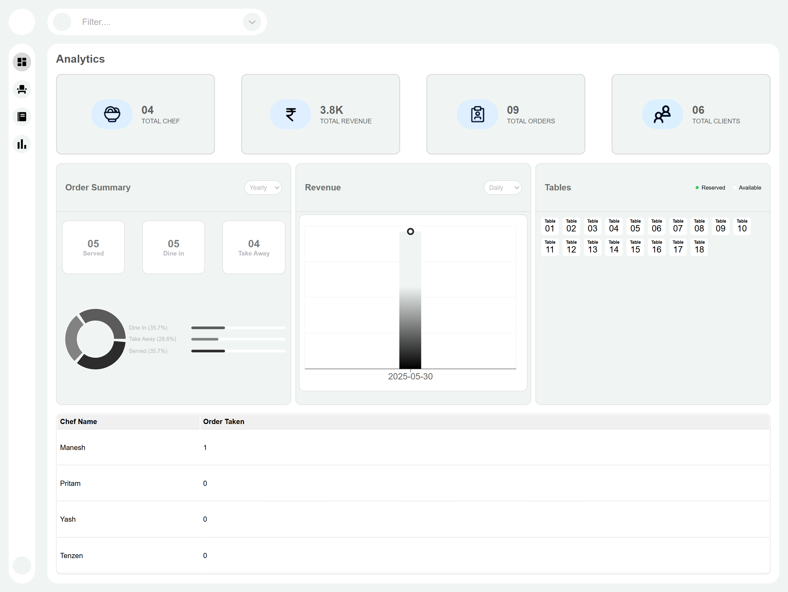
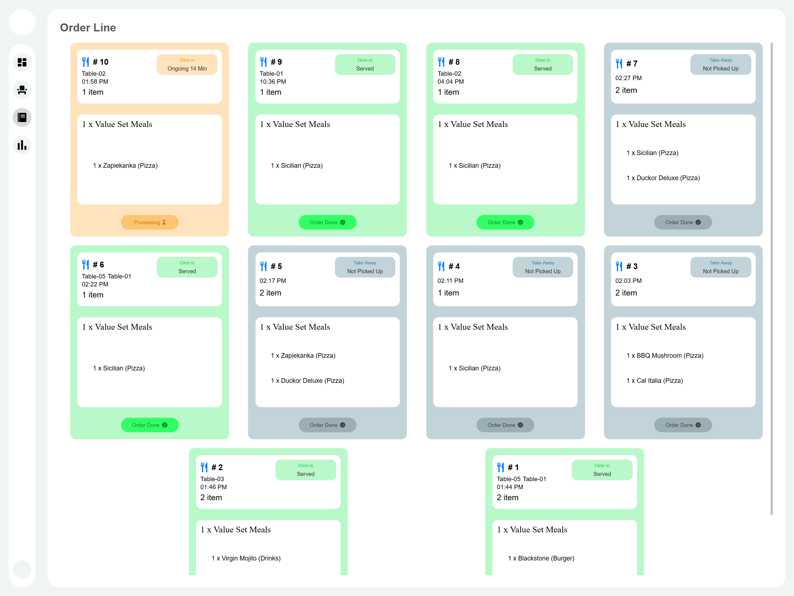
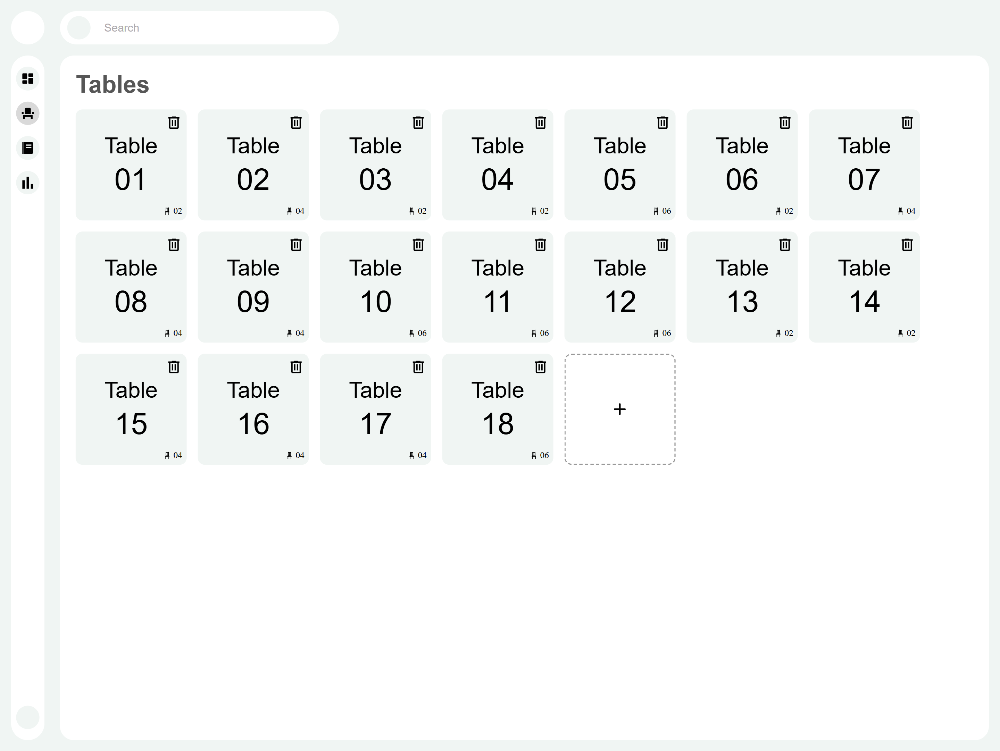
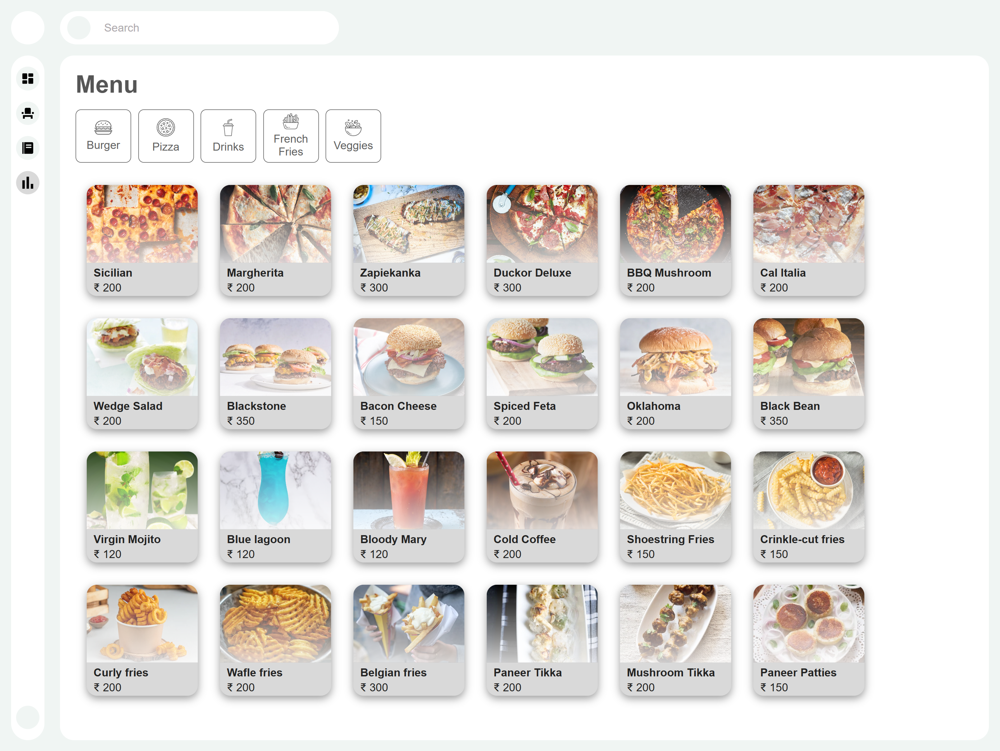

# 🏨 Hotel Management Dashboard

This is a full-stack Hotel Management system with two distinct frontends for **customers** and **admins**, built using the **MERN stack**. It supports ordering, table booking, chef assignment, and a powerful analytics dashboard.

---

## 📌 Features

- 📋 **Order Management** (Dine In / Take Away)
- 🍽️ **Table Reservation** with Smart Allocation Logic
- 👨‍🍳 **Chef Assignment** based on workload (estimated time)
- 📊 **Analytics Dashboard**
  - Total Chefs, Orders, Revenue, and Clients
  - Pie Chart for Order Type Distribution
  - Horizontal Bar for Order Summary
  - Revenue Growth Line Chart (Daily, Weekly, Yearly)
- 🔍 **Search & Filter** analytics sections by name

---

## 🧱 Tech Stack

- **Frontend (Customer)**: React.js (`frontend-customer`)
- **Frontend (Admin)**: React.js + Recharts (`frontend-admin`)
- **Backend**: Node.js, Express.js, MongoDB

---

## 🗂️ Project Structure

hotel-management/
│
├── backend/ # Express server with MongoDB
├── frontend-customer/ # UI for customers to place orders
└── frontend-admin/ # Admin dashboard with analytics and management


---

## 👥 Roles

### ✅ Customer (via `frontend-customer`)
- Browse menu
- Place dine-in or take-away orders
- Choose number of guests (for dine-in)

### ✅ Admin (via `frontend-admin`)
- Monitor order status
- Assign chefs based on workload
- Track table reservations
- View real-time analytics:
  - Total revenue, orders, customers, chefs
  - Revenue growth (daily, weekly, yearly)
  - Order type breakdown (pie + bar charts)

---

## 🌐 Deployment

- `frontend-customer`: [https://hotel-management-system-customer.vercel.app/](#)
- `frontend-admin`: [https://hotel-management-system-admin.vercel.app/](#)
- `backend`: [hosted]

---

## 📊 Key Features

| Feature                     | Customer | Admin |
|----------------------------|----------|-------|
| Place Orders               | ✅       | ❌    |
| View Analytics Dashboard   | ❌       | ✅    |
| Chef Assignment            | ❌       | ✅    |
| Table Reservation          | ✅       | ✅    |
| Revenue Growth Charts      | ❌       | ✅    |
| Real-Time Table Status     | ❌       | ✅    |
| Search Analytics Sections  | ❌       | ✅    |

---

## 🔍 Search Support (Admin)

Admins can search by:
- Section labels (e.g., "revenue", "chefs")
- Chef names  
Only matching sections will remain visible.

---

## 🚀 Getting Started

### 🔧 Backend

```bash
cd backend
npm install
npm run dev
```

### 🖥️ Customer Frontend

```bash
cd frontend-customer
npm install
npm run dev
```

### 📊 Admin Frontend

```bash
cd frontend-admin
npm install
npm run dev
```

---

## 📁 APIs Overview

| Endpoint                        | Method | Description                       |
| ------------------------------- | ------ | --------------------------------- |
| `/api/orders/`                  | POST   | Place a order                     |
| `/api/orders/`                  | GET    | Get all orders                    |
| `/api/orders/:id`               | PATCH  | Update order status               |
| `/api/tables/`                  | POST   | Add new table                     |
| `/api/tables/`                  | GET    | Get all tables                    |
| `/api/analytics/`               | GET    | Fetch total revenue, orders, etc. |
| `/api/analytics/order-summary`  | GET    | Order summary (daily/weekly/etc.) |
| `/api/analytics/revenue-growth` | GET    | Revenue growth by period          |

---

## 🧪 Sample Order Flow (Customer)

1. Select dining type (dine-in / take-away)
1. Choose menu items
1. Confirm guest count (for dine-in)
1. Place order → Assigned to chef automatically

---

## ✨ Charts Used (Admin)
- 🟢 Pie Chart: Order type breakdown
- 🟧 Horizontal Bar Chart: Order summary
- 🔵 Line-over-Bar Chart: Revenue growth vs baseline

---

## 🖼️ Screenshots

### 🏡 Customer Page



### 🪪 Admin Dashboard Page





---

## 👨‍💻 Developed By

Divij Jain
Full-Stack Developer | React.js • Node.js • MongoDB
